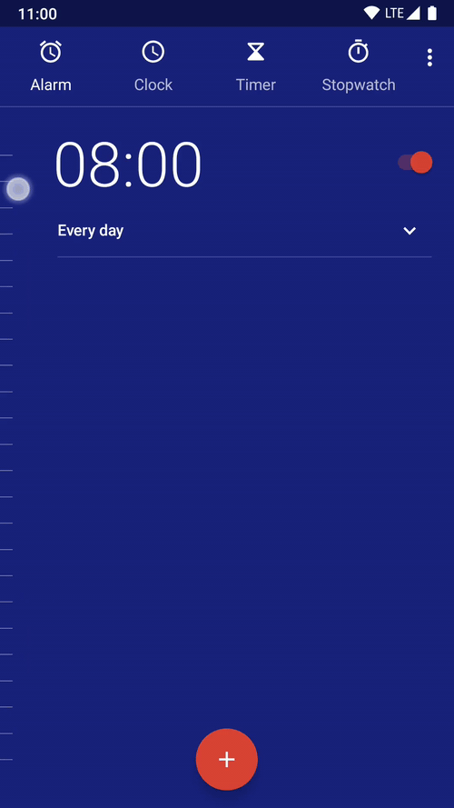
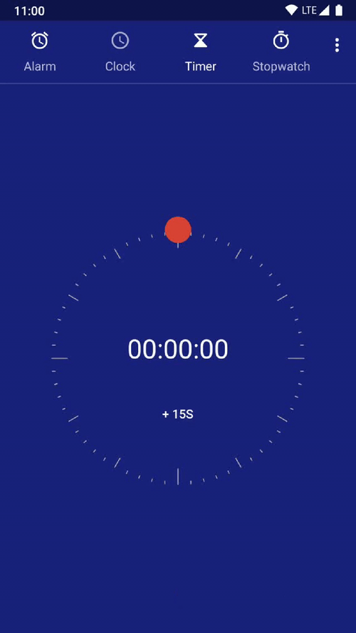

# Clockly

A clock application that needs fewer taps to get things done.

## Disclaimer

I currently do not provide support for this project but pull requests are welcome. An alarm application is kind of critical - do not trust that this app works reliably! I needed to manually add it to the list of battery protected apps to make it actually work.

## Demo
You can quickly and precisely create an alarm by touching the side of the alarm screen:  

You can quickly and precisely create a timer by dragging the red dot in circles:  

## License
This application is licensed under the GPL. Based on the official Android DeskClock application: https://android.googlesource.com/platform/packages/apps/DeskClock/ 
